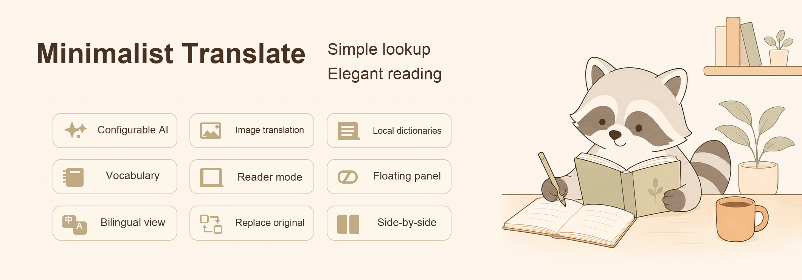

  <strong>English</strong> · <a href="./README.zh-CN.md">简体中文</a> · <a href="./README.ja.md">日本語</a>

  

Minimalist Translate is an open-source Chrome extension for reading foreign-language webpages without turning them into a separate translation document. It keeps links, tabs, buttons, and page structure usable while adding bilingual reading, focused reader views, dictionary lookup, and on-device image OCR.

## Read in the view that fits the page

- **Bilingual page** adds the translation below the source text while preserving the page's original structure. Editorial link cards keep their source copy and place the translation inside the same link; compact tabs can use an in-place label with hover-to-original.
- **Replace original** changes text nodes in place and keeps links, buttons, navigation, and tabs interactive.
- **Immersive reader** extracts the article, removes duplicate headings, keeps safe links, and provides a three-level outline, text-to-speech, plus paper, flat, column, and folio layouts.
- **Side-by-side view** creates an independent bilingual panel with synchronized navigation, adjustable width, and paragraph playback.

## Look up words without leaving the page

- Query Free Dictionary API, Jisho / JMdict, Moedict, and Wikipedia summaries.
- Load local MDX / MDD dictionaries and their CSS, images, and audio without uploading dictionary files.
- Add optional AI explanations and follow-up questions after configuring a supported provider.
- Save vocabulary and highlights locally, then search, filter, or export them as Markdown and CSV.

## Translate text inside images locally

Image OCR runs in the browser with the Tesseract.js runtime bundled with the extension. The first use of a language downloads its model from a public model source and stores it in the browser cache. The original image is not sent to an OCR service; only recognized text is sent to the selected translation engine when translation is requested.

The translated image stays in the original page position. Recognized lines are written back with local alignment, neighbouring-line, and background-contrast safeguards, and the source image remains available at any time.

## Translation engines

Google Translate can be used as the basic engine. The following integrations require your own configuration:

- DeepL
- DeepSeek
- OpenAI
- Claude
- Gemini
- Ollama
- Custom compatible APIs

## Install locally

1. Download and extract the latest package from [Releases](https://github.com/Cuteraccoons/minimalist-translate/releases/latest).
2. Open `chrome://extensions/` in Chrome.
3. Enable **Developer mode**.
4. Choose **Load unpacked** and select the `Jijian-Translate` folder.

Chrome cannot load the ZIP file directly. When updating a local installation, replace the files in the same folder and refresh the extension from `chrome://extensions/`.

## Data boundaries

- API keys, custom service endpoints, and model configuration stay on the current device; ordinary interface and reading preferences may sync through Chrome Sync.
- Vocabulary, highlights, translation cache, and local dictionary connections stay on the current device.
- Local MDX / MDD files are not uploaded.
- OCR runs locally; recognized text is sent to the selected translation service only when translation is requested.
- Online translation, dictionary, and optional AI requests are governed by the selected provider's policy.
- The project has no custom account system or cloud synchronization service.

See the [privacy notice](PRIVACY.md) for the complete service and permission boundary.

## Project and appreciation

If Minimalist Translate helps with your reading, you can leave an optional appreciation through [Afdian](https://www.ifdian.net/a/longmaojun). It recognizes the open-source work already released and does not purchase exclusive features, scheduling, or maintenance commitments.

## Contributing

Bug reports, compatibility examples, documentation improvements, and focused code contributions are welcome. Read [CONTRIBUTING.md](CONTRIBUTING.md) before opening a pull request. Please report security issues through the process in [SECURITY.md](SECURITY.md), not through a public issue.

## Acknowledgements

OpenAI Codex was used as an assistive tool during development and code review.

## License

Minimalist Translate is released under the [Apache License 2.0](LICENSE). Third-party components remain subject to their own licenses and notices; see [NOTICE](NOTICE) and the notice files under `vendor/`.
